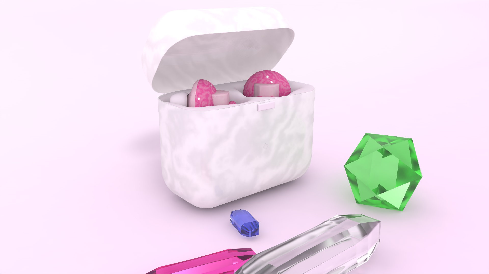

##   Crystal ClearBuds  
 

*Current Progress: Responsive Prototype of Crystal ClearBud's Website*

Welcome the official Crystal ClearBuds website!

View our website to learn all about our new Crystal ClearBuds collection. 

## Process   
- Earbud model made with Cinema 4D & exported as a GLTF file into Model Veiwer
- Integrated the AR Object, X-Ray Viewer & Scrolling Animation into Crystal ClearBud's website
- Promotional Video made with After Effects
- Logo & gradient designs made with Adobe Illustrator
- Utilized JavaScript & Greensock to dynamically display information & create hover & scroll effects

## Contributing   
1. Fork it!
2. Create your feature branch: `git checkout -b my-new-feature`
3. Commit your changes: `git commit -am 'Add some feature'`
4. Push to the branch: `git push origin my-new-feature`
5. Submit a pull request :D

## Credits   
Callidora Idsardi 

## License   
MIT
